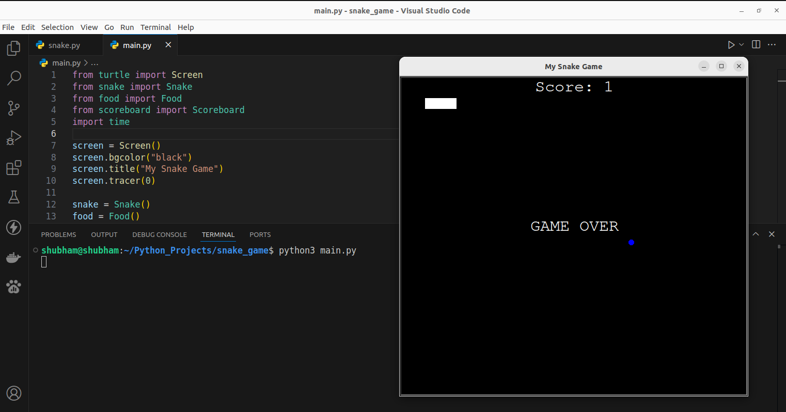

# Snake Game

## Screenshot

This project is a classic Snake Game built with [Python 3](https://www.python.org/downloads). using the Pygame library. The player controls a snake that moves around the screen to eat food, causing the snake to grow in length. The game ends if the snake collides with the screen borders or itself. This project offers an engaging way to practice Python programming and game development fundamentals, including handling user input, collision detection, and updating graphics in real time.

## ⚙️ Languages or Frameworks Used:

+ `pip install turtle`
+ `import random`
+ `import time`

## 🌟 How to run:

Running the script is simple! Just open a terminal in the folder where your script is located and run the following command:

+ `python3 main.py`

## 📺 Demo:

